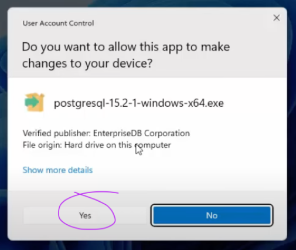
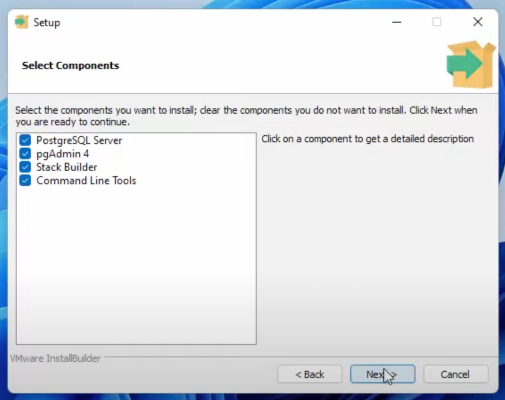
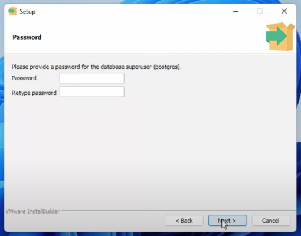

# Install Node.js
###  Installation Steps

1. **Download the Windows installer from the [Nodes.js® web site](https://nodejs.org/en).**
2. **Choose the LTS version** that’s shown on the left.

3. **Run the installer** (the .msi file you downloaded in the previous step.)
4. **Follow the prompts in the installer** (Accept the license agreement, click the NEXT button a bunch of times and accept the default installation settings).

5. **Restart your computer.** You won’t be able to run Node.js® until you restart your computer. 

6. Confirm that Node has been installed successfully on your computer by opening a Hyper terminal and typing in the commands `node --version`.
You should see the version of node you just installed.

# Install PostgreSQL and pgAdmin
### Installation instructions
1. **Windows Users:** Download the Postgres Installer here:
    <https://sbp.enterprisedb.com/getfile.jsp?fileid=1258649>

2. Double click on the downloaded file to start the installer.

3. **Windows Users:** If you see a pop up asking for permission to run the installer, select YES.

4. Click **Next** to continue through the installer, until you reach this pane and make sure that everything is selected especially **pgAdmin**.

5. Continue clicking **Next** until you reach this screen. Your superuser username is **postgres** and you need to set a password. **Make sure you write this password down**. We will need this later to access our database.

6. Continue through the installer, leave everything as the default and just keep clicking **Next**. Once installation completes then you're done you can click **Finish** and you can continue to the next lesson!

#### 
NOTE

- If Stack Builder launches after installation completes, just close it. We will be doing everything from scratch together in the next lesson without using a wizard.

# Set up your database with PostgreSql
###  Installation Steps

1. **Create your database with name <strong style="color:red">`school_manage`</strong>**
   
2. **Open a command-line / terminal window (cmd) and move to the bin directory of your postgres** EX: cd C:\Program files\...\Postgres\16\bin\

3. **Connect to the “school_manage” database on postgres server using superuser account “postgres”, and execute the command in sql file to import the “school_manage” database:** psql -d school_manage -U postgres -f [path/] manual\school.sql

#### 
NOTE

- **Data main of database in file > manual\school.sql**

- **You can change these lines so that the server can connect to your database.**

# Run your server
###  Installation Steps

1. **Open a terminal window(cmd) and move to the main file school managemet \path\\"school manage" or if you have a vscode simply open the folder**
2. **Run you server by comand `node index.js`** .

**If your terminal log like this it success**:

3. **Open you browser and type in url => localhost:3000**

